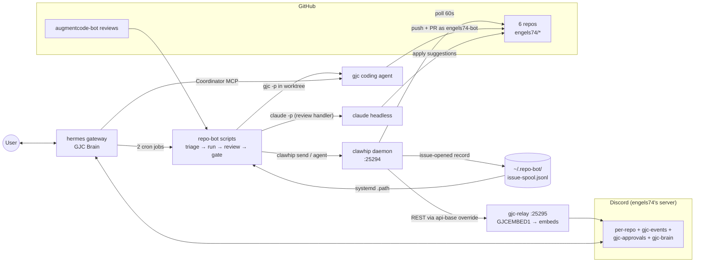

<!--
status: draft            # draft | reviewed | verified
last_verified: 2026-07-07
sources:
  - all component pages in this directory (10, 20, 30, 35, 40)
maintainer_notes: >
  Edit this file in isolation. Keep headings stable; append to Changelog at the bottom.
  This page must stay readable in under five minutes — push detail to component pages.
-->

# System overview

## What this system is

An **autonomous GitHub repo-bot fleet** running natively on this host (user `cvps`): GitHub issues
on six personal repos are triaged by a cheap LLM, fixed by a coding agent in isolated git
worktrees, reviewed, and advisory-gated for a human merge — with every step narrated to Discord as
rich embeds, and a conversational Discord "brain" available to drive the coding agent on demand.

Three upstream source projects, one locally-authored component, and a shell glue layer:

| # | Component | Role | Language | Source | Runtime/config | Started by |
|---|---|---|---|---|---|---|
| 1 | **gajae-code (`gjc`)** | Coding-agent harness that writes the actual fixes and opens PRs | Rust + TypeScript (Bun) | `~/github/engels74/gjc/gajae-code` | `~/.gjc` | On demand: `gjc-run.sh` (headless) or hermes via Coordinator MCP |
| 2 | **hermes-agent** | Always-on Discord "GJC Brain": chat, cron scheduler, kanban; drives gjc via MCP | Python | `~/github/engels74/gjc/hermes-agent` | `~/.hermes` | `hermes-gateway.service` |
| 3 | **clawhip** | Event-to-Discord notification router; polls GitHub, writes the issue spool | Rust | `~/github/engels74/gjc/clawhip` | `~/.clawhip` | `clawhip.service` (daemon on 127.0.0.1:25294) |
| 4 | **gjc-relay** | Loopback proxy turning clawhip's plain-text Discord posts into styled embeds | Rust (local, ~710 lines) | `~/.gjc-relay/src` | `~/.gjc-relay` | `gjc-relay.service` (127.0.0.1:25295) |
| 5 | **repo-bot** | Shell glue: issue → triage → gjc run → review → merge gate | Bash | `~/github/engels74-bot/gjc-bot-scripts` (pipeline-stage dirs: `intake/` `run/` `review/` `maintenance/` `lib/` `systemd/`) | `~/.repo-bot` (state) | systemd path unit + timers, 2 hermes cron jobs |

Also on the field: **`engels74-bot`** (the bot's GitHub identity), **`augmentcode[bot]`** (external
PR reviewer the pipeline reacts to), **headless `claude`** (Claude Code, used only as the review
handler), and **NanoGPT/`minimax-m3`** (the cheap no-tools "brain model" for triage and merge
verdicts).

## Where each component lives and runs

A common misread: the source checkouts are **not** where the services run. Two distinct GitHub
areas, and a build/install step in between:

- **`~/github/engels74-bot/` — the user's OWN `gjc-*` projects**: `gjc-bot-scripts` (the repo-bot
  shell glue), `gjc-server-tool` (the `stackman` ops console), and `gjc-architecture` (this doc
  set). These commit as the `engels74-bot` identity.
- **`~/github/engels74/gjc/` — three UPSTREAM third-party engines**, cloned as *reference source
  only* (they are *not* under `engels74-bot`, *not* the user's own repos, and *not* where the apps
  run from): `gajae-code` (remote `Yeachan-Heo/gajae-code`), `hermes-agent`
  (remote `nousresearch/hermes-agent`), and `clawhip` (remote `Yeachan-Heo/clawhip`).

The services do **not** run from those upstream checkouts, nor are the checkouts the build input.
Each app is installed independently through its own package manager (or, for hermes, a separate
deployed copy), and the units run from there:

| Component | Reference checkout | Installed via | Runs from |
|---|---|---|---|
| gajae-code (`gjc`) | `~/github/engels74/gjc/gajae-code` | bun global package (`gajae-code`, v0.9.0) | `~/.bun/bin/gjc` |
| hermes-agent | `~/github/engels74/gjc/hermes-agent` | separate deployed copy + editable venv under `~/.hermes/hermes-agent` (v0.18.0) | `~/.hermes/hermes-agent/venv/bin/python` (WorkingDirectory `~/.hermes`) |
| clawhip | `~/github/engels74/gjc/clawhip` | `cargo install` from crates.io (v0.6.11) | `~/.cargo/bin/clawhip` |
| gjc-relay | `~/.gjc-relay/src` (locally authored) | `cargo build` in place | `~/.gjc-relay/gjc-relay` |

Pattern: the checkouts under `~/github/engels74/gjc/` are **reference source only** — read/diff
them, but the running apps are installed independently via package managers (`cargo install` from
crates.io, bun global) or a separate deployed copy (hermes), and updates arrive through those
channels, not by rebuilding the checkout. Only the locally-authored **gjc-relay** is built directly
from its own tree (`~/.gjc-relay/src`). The base toolchain (`gh`, `jq`, `tmux`, `python`) comes from
linuxbrew; the fleet apps themselves are not brew formulae. The `~/.gjc`, `~/.hermes`, `~/.clawhip`
dirs are config/state homes, not source trees.

## Topology

Two Discord bot identities, deliberately separate paths: **GJC Clawhip** posts notifications
(everything on the clawhip→relay path); **GJC Brain** (hermes) converses in plain markdown and
never touches the relay. All fleet listeners are loopback-only; there are no inbound ports.
The in-path relay is supervised out-of-band: `gjc-dlq-watch.service` (alarms on clawhip DLQ-bury —
the operative watchdog) and `gjc-relay-alert.service` (`OnFailure`, rarely fires by design) both
curl Discord directly, bypassing clawhip and the relay
([35](35-gjc-relay.md) · [70](70-deployment-and-operations.md)).

## How a typical job flows (one paragraph)

clawhip's monitor notices a new issue and both posts a notice to the repo's Discord channel and
appends a record to the issue spool; a systemd path unit runs the spool adapter, which dedups,
re-fetches the issue via `gh`, and asks a **no-tools** LLM "actionable?"; if yes, `gjc-run.sh`
creates a fresh worktree and runs headless `gjc`, which commits, pushes, and opens a PR as
`engels74-bot`; augmentcode[bot] reviews the PR, and if it leaves suggestions, a detector launches
a headless `claude` handler that applies them; every 10 minutes a merge gate checks CI-green bot
PRs and posts an advisory `MERGE_READY`/`REQUEST_CHANGES` comment — and a **human** merges. Every
hop is narrated to Discord through clawhip → gjc-relay as styled embeds. Full walk-through with
sequence diagram: [60-data-flow-and-integration.md](60-data-flow-and-integration.md).

## History in one breath

Built incrementally through Phases A–G (2026-07-05/06): hermes brain → bot GitHub
identity → Discord → clawhip → gjc + Coordinator MCP → automation lanes → fan-out to 6 repos.
(Those phases were tracked in an earlier hermes-stack build-log, since retired and superseded by
this doc set.) The same evening, a separate "Discord unification" wave added gjc-relay and the
embed design system — which post-dated that build-log entirely. A follow-up wave (2026-07-07, after the first
full EasyHDR pipeline exercise) added issue/CI embed routes, multi-embed batch splitting in the
relay, and hermes tuning — and hermes' brain model switched from NanoGPT/minimax-m3 to the Codex
subscription (`gpt-5.5`). Timeline & staleness:
[90-glossary-and-open-questions.md](90-glossary-and-open-questions.md).

## Reading order for newcomers

1. This page, then the diagram + tables in [README.md](README.md).
2. [60-data-flow-and-integration.md](60-data-flow-and-integration.md) — how it actually works.
3. [40-repo-bot-automation.md](40-repo-bot-automation.md) — the spine, script by script.
4. Component pages as needed: [10](10-gajae-code.md) · [20](20-hermes-agent.md) ·
   [30](30-clawhip.md) · [35](35-gjc-relay.md).
5. [50](50-configuration-and-state.md) + [70](70-deployment-and-operations.md) for state/ops,
   [90](90-glossary-and-open-questions.md) for terms and known unknowns.

## Open questions

- See the consolidated list in
  [90-glossary-and-open-questions.md](90-glossary-and-open-questions.md#open-questions).

## Changelog

- 2026-07-06 — Initial draft.
- 2026-07-07 — Verification pass: component table, topology, and job-flow paragraph re-verified —
  structurally unchanged. Added the relay watchdog note (dlq-watch/relay-alert), the 2026-07-07
  wave + Codex model switch to the history paragraph.
- 2026-07-07 (repo-move pass) — Docs relocated to the `gjc-architecture` git repo (was
  `~/documentation/architecture/`). Fixed dead source path: repo-bot component row now cites
  `~/github/engels74-bot/gjc-bot-scripts` (renamed from `gjc-bot`) with its new pipeline-stage
  layout, replacing the dead `~/scripts/repo-bot`; confirmed all four subfolders + `systemd/` on
  disk and all four systemd units' `ExecStart=` paths live. Topology diagram's `repo-bot scripts`
  node re-checked against the actual stage order (intake → run → review/merge-gate) — unchanged,
  still accurate. Rows 1–4 of the component table re-confirmed against live paths; no drift found.
  No `gjc-server-tool`/stackman ops-console reference exists on this page (nothing to rename).
- 2026-07-07 (runbook-retirement pass) — The earlier hermes-stack build-log/runbook has been
  deleted; this doc set is now the single source of truth. Removed it from this page's `sources`
  and dropped the open question about its on-disk path; reframed the Phases A–G history note to
  past tense. Added a "Where each component lives and runs" subsection codifying the repo split
  (`engels74-bot/gjc-*` = own projects vs upstream `engels74/gjc/*` engines) and the
  source→built/installed→service-runs-from-there pattern; verified live against `git remote` and
  `systemctl cat`.
- 2026-07-07 (install-provenance refinement) — Corrected the "lives and runs" subsection: the
  `engels74/gjc/` checkouts are **reference source only**, not the build input. Documented the real
  per-app install channel (verified via `~/.cargo/.crates2.json`, bun global node_modules, the venv
  `__editable__` marker): clawhip = `cargo install` from crates.io (v0.6.11), gjc = bun global
  package (v0.9.0), hermes = separate deployed copy + editable venv under `~/.hermes` (v0.18.0),
  gjc-relay = built in place. Noted the fleet apps are not brew formulae (linuxbrew = base toolchain).
