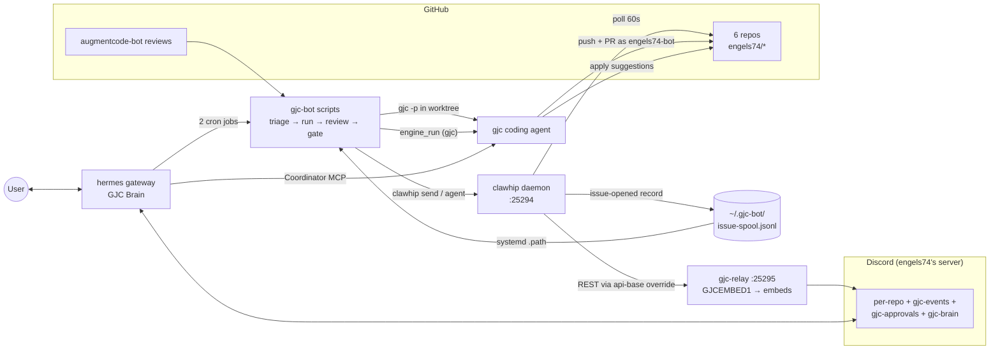

<!--
status: draft            # draft | reviewed | verified
last_verified: 2026-07-09
sources:
  - all component pages in this directory (10, 20, 30, 35, 40)
maintainer_notes: >
  Edit this file in isolation. Keep headings stable. Changelog is a single current-state
  rebaseline entry — rewrite this page to current state rather than appending; prior history
  lives in git. This page must stay readable in under five minutes — push detail to component pages.
-->

# System overview

## What this system is

An **autonomous GitHub gjc-bot fleet** running natively on this host (user `cvps`): GitHub issues
on six personal repos are triaged by a cheap LLM, fixed by a coding agent in isolated git
worktrees, reviewed, and advisory-gated for a human merge — with every step narrated to Discord as
rich embeds, and a conversational Discord "brain" available to drive the coding agent on demand.

Three upstream source projects, one locally-authored component, and a shell glue layer:

| # | Component | Role | Language | Source | Runtime/config | Started by |
|---|---|---|---|---|---|---|
| 1 | **gajae-code (`gjc`)** | Coding-agent harness that writes the actual fixes and opens PRs | Rust + TypeScript (Bun) | `~/github/engels74/gjc/gajae-code` | `~/.gjc` | On demand: `gjc-run.sh` (headless) or hermes via Coordinator MCP |
| 2 | **hermes-agent** | Always-on Discord "GJC Brain": chat, cron scheduler, kanban; drives gjc via MCP | Python | `~/github/engels74/gjc/hermes-agent` | `~/.hermes` | `hermes-gateway.service` |
| 3 | **clawhip** | Event-to-Discord notification router; polls GitHub, writes the issue spool | Rust | `~/github/engels74/gjc/clawhip` | `~/.clawhip` | `clawhip.service` (daemon on 127.0.0.1:25294) |
| 4 | **gjc-relay** | Loopback proxy turning clawhip's plain-text Discord posts into styled embeds | Rust (local, ~6.3k lines / 12 modules) | `~/github/engels74-bot/gjc-fleet` (`relay/` subdir) | `~/.gjc-relay` | `gjc-relay.service` (127.0.0.1:25295, user unit) |
| 5 | **gjc-bot** | Shell glue: issue → triage → gjc run → review → merge gate, plus automerge, nightly fleet-update, and coordinator tmux-reaper lanes | Bash | `~/github/engels74-bot/gjc-fleet` (`pipeline/` subdir: `intake/` `run/` `review/` `maintenance/` `lib/`; `systemd/` unit templates at the repo root) | `~/.gjc-bot` (state) | user-scope systemd path unit + timers, 2 hermes cron jobs |

Also on the field: **`engels74-bot`** (the bot's GitHub identity), **`augmentcode[bot]`** (external
PR reviewer the pipeline reacts to), the **`pipeline/lib/engine.sh` engine dispatcher** (`engine_run`
fronts the review/policy/ci-fix handlers; **`gjc` is the active engine** post-cutover, headless
`claude -p` remains a selectable fallback, not the default), and **NanoGPT/`minimax-m3`** (the cheap
no-tools "brain model" for triage and merge verdicts).

## Where each component lives and runs

A common misread: the source checkouts are **not** where the services run. Two distinct GitHub
areas, and a build/install step in between:

- **`~/github/engels74-bot/` — the user's OWN `gjc-*` projects**: since 2026-07-07 the pipeline
  scripts, the relay crate, the systemd unit templates, and this doc set have been consolidated
  into a single monorepo, **`gjc-fleet`** (`pipeline/` `relay/` `render/` `systemd/` `docs/`), plus
  the still-separate `gjc-server-tool` (the `stackman` ops console). All commit as the
  `engels74-bot` identity. The three former repos this replaced — `gjc-bot-scripts`, `gjc-relay`,
  and `gjc-architecture` — are archived on GitHub with pointer READMEs; their history was preserved
  via merge into `gjc-fleet`. Its **`fleet/` subfolder** holds every pipeline-owned working copy —
  the six `engels74/*` app clones, their `*.gajae-code-worktrees/` buckets, and the isolated
  `review/` checkouts (the scripts' `GH_ROOT`, clawhip's monitor paths, and hermes' workdir roots
  all point at `~/github/engels74-bot/fleet`).
- **`~/github/engels74/gjc/` — three UPSTREAM third-party engines**, cloned as *reference source
  only* (they are *not* under `engels74-bot`, *not* the user's own repos, and *not* where the apps
  run from): `gajae-code` (remote `Yeachan-Heo/gajae-code`), `hermes-agent`
  (remote `nousresearch/hermes-agent`), and `clawhip` (remote `Yeachan-Heo/clawhip`).

The services do **not** run from those upstream checkouts, nor are the checkouts the build input.
Each app is installed independently through its own package manager (or, for hermes, a separate
deployed copy), and the units run from there:

| Component | Reference checkout | Installed via | Runs from |
|---|---|---|---|
| gajae-code (`gjc`) | `~/github/engels74/gjc/gajae-code` | bun global package (`gajae-code`, v0.9.0) | `~/.bun/bin/gjc` |
| hermes-agent | `~/github/engels74/gjc/hermes-agent` | separate deployed copy + editable venv under `~/.hermes/hermes-agent` (v0.18.0) | `~/.hermes/hermes-agent/venv/bin/python` (WorkingDirectory `~/.hermes`) |
| clawhip | `~/github/engels74/gjc/clawhip` | `cargo install` from crates.io (v0.6.11) | `~/.cargo/bin/clawhip` |
| gjc-relay | `~/github/engels74-bot/gjc-fleet` (`relay/` subdir, locally authored) | `cargo build --release` in `relay/`, binary copied over | `~/.gjc-relay/gjc-relay` |

Pattern: the checkouts under `~/github/engels74/gjc/` are **reference source only** — read/diff
them, but the running apps are installed independently via package managers (`cargo install` from
crates.io, bun global) or a separate deployed copy (hermes), and updates arrive through those
channels, not by rebuilding the checkout. The locally-authored **gjc-relay** follows the same
source-repo → deployed-runtime pattern, except its source now lives in the user's own monorepo
(`engels74-bot/gjc-fleet`, `relay/` subdir) and the "install channel" is a local `cargo build
--release` + copy of the binary into `~/.gjc-relay/`. The base toolchain (`gh`, `jq`, `tmux`,
`python`) comes from linuxbrew; the fleet apps themselves are not brew formulae. The `~/.gjc`,
`~/.hermes`, `~/.clawhip`, `~/.gjc-relay` dirs are config/state/runtime homes, not source trees —
unaffected by the monorepo move.

**Three-layer config model (added 2026-07-07):** `gjc-fleet` itself is layer 1, the
source-of-truth for code, unit *templates*, config *templates*, and docs. Layer 2 is the untracked,
host-local `~/.config/gjc-fleet/fleet.toml` (0600) — operator identity, the Discord
name→numeric-channel-ID map (the only place IDs live besides rendered env files), path overrides,
version pins, and secret-file pointers (names only). Layer 3 is the set of rendered artifacts under
`~/.` (config files, env files, and — since all units are now user-scope — the installed unit files
under `~/.config/systemd/user/`). The renderer, `render/render.sh`, turns layer 2 into layer 3; see
[45-fleet-config.md](45-fleet-config.md) and
[50-configuration-and-state.md](50-configuration-and-state.md).

## Topology

Two Discord bot identities, deliberately separate paths: **GJC Clawhip** posts notifications
(everything on the clawhip→relay path); **GJC Brain** (hermes) converses in plain markdown and
never touches the relay. All fleet listeners are loopback-only; there are no inbound ports.
The in-path relay is supervised out-of-band: `gjc-dlq-watch.service` (alarms on clawhip DLQ-bury —
the operative watchdog) and `gjc-relay-alert.service` (`OnFailure`, rarely fires by design) both
curl Discord directly, bypassing clawhip and the relay
([35](35-gjc-relay.md) · [70](70-deployment-and-operations.md)). Off to the side of this
request-driven flow, gjc-bot also runs a nightly fleet-update lane (`fleet-update.sh`, quiesces the
fleet then updates `gjc`/tooling) and a coordinator tmux reaper (folded into the worktree janitor) —
both default-OFF, narrated the same way through clawhip → gjc-relay.

## How a typical job flows (one paragraph)

clawhip's monitor notices a new issue and both posts a notice to the repo's Discord channel and
appends a record to the issue spool; a systemd path unit runs the spool adapter, which dedups,
re-fetches the issue via `gh`, and asks a **no-tools** LLM "actionable?"; if yes, `gjc-run.sh`
creates a fresh worktree and runs headless `gjc`, which commits, pushes, and opens a PR as
`engels74-bot`; augmentcode[bot] reviews the PR, and if it leaves suggestions, a detector dispatches
the review handler through `pipeline/lib/engine.sh` (`engine_run`, **gjc** active post-cutover) to
apply them; every 10 minutes a merge gate checks CI-green bot PRs and posts an advisory
`MERGE_READY`/`REQUEST_CHANGES` comment — and a **human** merges (or, on repos with the still
default-OFF automerge lane enabled, an automated squash-merge). Every hop is narrated to Discord
through clawhip → gjc-relay as styled embeds. Full walk-through with sequence diagram:
[60-data-flow-and-integration.md](60-data-flow-and-integration.md).

## History in one breath

Built incrementally through Phases A–G (2026-07-05/06): hermes brain → bot GitHub
identity → Discord → clawhip → gjc + Coordinator MCP → automation lanes → fan-out to 6 repos.
(Those phases were tracked in an earlier hermes-stack build-log, since retired and superseded by
this doc set.) The same evening, a separate "Discord unification" wave added gjc-relay and the
embed design system — which post-dated that build-log entirely. A follow-up wave (2026-07-07, after the first
full EasyHDR pipeline exercise) added issue/CI embed routes, multi-embed batch splitting in the
relay, and hermes tuning — and hermes' brain model switched from NanoGPT/minimax-m3 to the Codex
subscription (`gpt-5.5`). Later the same day, the **gjc-fleet monorepo + user-systemd migration**
consolidated the pipeline/relay/docs repos into one monorepo behind a three-layer `fleet.toml`
config model and moved every fleet unit from system-level to user-scope systemd. Timeline &
staleness: [90-glossary-and-open-questions.md](90-glossary-and-open-questions.md).

## Reading order for newcomers

1. This page, then the diagram + tables in [README.md](README.md).
2. [60-data-flow-and-integration.md](60-data-flow-and-integration.md) — how it actually works.
3. [40-gjc-bot-automation.md](40-gjc-bot-automation.md) — the spine, script by script.
4. Component pages as needed: [10](10-gajae-code.md) · [20](20-hermes-agent.md) ·
   [30](30-clawhip.md) · [35](35-gjc-relay.md) · [46](46-github-house-style.md) ·
   [47](47-renovate-policy.md).
5. [50](50-configuration-and-state.md) + [70](70-deployment-and-operations.md) for state/ops,
   [90](90-glossary-and-open-questions.md) for terms and known unknowns.

## Open questions

- See the consolidated list in
  [90-glossary-and-open-questions.md](90-glossary-and-open-questions.md#open-questions).

## Changelog

- 2026-07-09 (v2-current-state rewrite) — Doc set rebaselined to current state; prior history in git.
  This page: engine cutover to gjc + new automerge/fleet-update/reaper lanes folded into component
  table, topology, and job flow; relay size + reading order refreshed.
